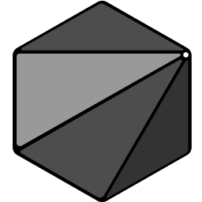

<p align="center">
  
  <br>
  <strong>An efficient, procedural, and pragmatic programming language</strong>
  <br>
  <br>  
  <a href="https://github.com/onyx-lang/onyx/releases/latest">
    
  </a>
  <a href="https://onyxlang.io/docs">
    
  </a>
  <a href="https://try.onyxlang.io">
    
  </a>
  <br/>
  <a href="https://discord.com/invite/bhuN36dqj7">
    
  </a>
  <a href="https://github.com/onyx-lang/onyx/actions">
      
  </a>
  <a href="https://opensource.org/licenses/BSD-2-Clause">
      
  </a>
</p>

# The Onyx Programming Language

Onyx is a general purpose, efficient, procedural and pragmatic programming language for application development.
Onyx compiles solely to WebAssembly through a custom backend, leading to *blazingly-fast* build times.

<!-- Once Onyx is able to be added to the GitHub syntax repo, this can be changed -->
```odin
use core {*}

Person :: struct { age: i32; name: str }

main :: () {
    // Generate a list of 30 random people
    people := Iterator.from(0 .. 30)
        |> Iterator.map(_ => Person.{
            random.between(1, 10)
            random.string(10, alpha_numeric=true)
        })
        |> Iterator.collect()

    // Sort them by age
    Slice.sort(people, (a, b) => a.age - b.age)

    // Group them by age
    group_iter := Iterator.from(people)
        |> Iterator.group_by((a, b) => a.age == b.age)

    // Print the groups of people
    for group in group_iter {
        printf("People of age {}:\n", group.first.age)

        for v in group.second {
            printf("    {}\n", v.name)
        }
    }
}
```

# Resources

### [Onyx Installation](https://onyxlang.io/docs/install)

Install Onyx on your Linux, MacOS, or Windows system.

### [Onyx Documentation](https://onyxlang.io/docs)

Learn about the various aspects of Onyx, from the language semantics and syntax, to the core and third-party packages.

### [Onyx Book](https://docs.onyxlang.io/book/Overview.html)

The official source of language syntax and semantics documentation.

### [Onyx Playground](https://try.onyxlang.io)

Try Onyx online without installing anything

### [Onyx Discord](https://discord.com/invite/bhuN36dqj7)

Discuss with others about Onyx and get quick feedback and help on your Onyx projects.

# Disclaimer

> Onyx is still under active development, and some features are subject to change.
>
> Onyx is primarily developed for Linux and MacOS. Windows support exists, but the development experience on Windows is not as refined as the Linux and MacOS development experience.
